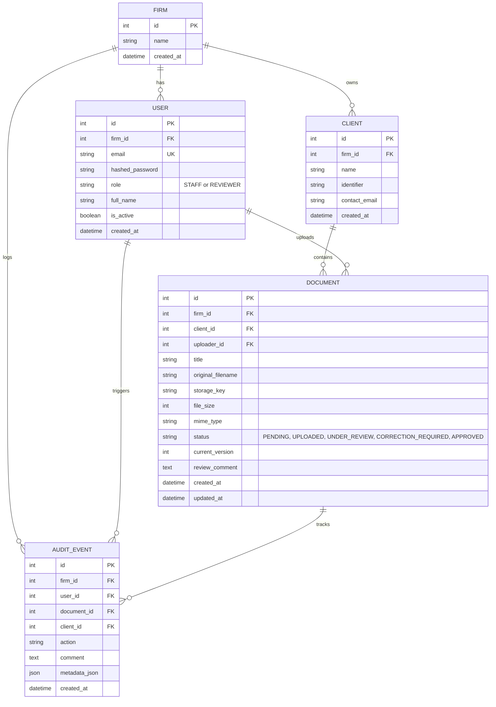

# System Design: Mini Audit Document Review System

## 1. Overview
The Mini Audit Document Review System is a secure, multi-tenant document review and compliance tracking prototype designed for small to mid-sized Chartered Accountant (CA) firms. 

It provides an end-to-end audit document workflow:
**Client Creation → Document Upload → Document Review → Approve OR Request Correction → Re-upload Corrected Document → Re-review → Append-Only Audit History**.

Strict scope boundaries are maintained: no unrelated features (OCR, chat, billing, AI agents) are introduced. The design prioritizes backend multi-tenant isolation, role-based access control (RBAC), private file storage, and explainable software engineering.

---

## 2. Technology Stack & Environment
- **Frontend**: Next.js 14+ (App Router), TypeScript, Tailwind CSS, Lucide icons.
- **Backend**: FastAPI, Python 3.12, Pydantic v2.
- **Database & ORM**: SQLAlchemy 2.0. Configured via `DATABASE_URL` with standard relational tables. Defaults to SQLite (`sqlite:///./audit.db`) for zero-friction local execution, and connects to PostgreSQL without modification when a PostgreSQL connection string is supplied.
- **Authentication**: JWT authentication with modern password hashing (`Argon2id` via `pwdlib`/`passlib`/`argon2-cffi`), delivered via secure `HttpOnly` cookies and Bearer token fallback.
- **Storage**: Private local filesystem storage (`./backend/storage/{firm_id}/{uuid}`) with backend streaming verification.

---

## 3. Multi-Tenant Security & Tenant Isolation
Tenant isolation is enforced strictly on the backend across all entities and queries.

1. **Firm Identity Authority**:
   - `firm_id` is never accepted from client request bodies or query parameters as authority.
   - `firm_id` is always derived server-side from the authenticated JWT session (`current_user.firm_id`).
2. **Compound Filtering on All Tenant Resources**:
   - Client queries: `WHERE id = :id AND firm_id = :current_user_firm_id`
   - Document queries: `WHERE id = :id AND firm_id = :current_user_firm_id`
   - Audit Event queries: `WHERE document_id = :id AND firm_id = :current_user_firm_id`
3. **Information Leakage Prevention**:
   - Accessing a resource belonging to another firm returns `404 Not Found` (never `403 Forbidden` which would confirm existence of an IDOR target).

---

## 4. Database Schema

---

## 5. Role-Based Access Control (RBAC) & State Machine

### Roles:
- **STAFF**:
  - View firm's clients and documents.
  - Upload new audit documents (Status becomes `UPLOADED`, version = 1).
  - Re-upload corrected documents when status is `CORRECTION_REQUIRED` (Status becomes `UPLOADED`, version increments).
  - Cannot approve documents or request corrections.
- **REVIEWER**:
  - View firm's clients and documents.
  - Start review on `UPLOADED` documents (Status becomes `UNDER_REVIEW`).
  - Approve `UNDER_REVIEW` documents (Status becomes `APPROVED`).
  - Request correction on `UNDER_REVIEW` documents with mandatory comment (Status becomes `CORRECTION_REQUIRED`).
  - View audit history.

### State Transitions:
1. `PENDING` → `UPLOADED` (Triggered by Staff upload)
2. `UPLOADED` → `UNDER_REVIEW` (Triggered by Reviewer clicking Start Review)
3. `UNDER_REVIEW` → `APPROVED` (Triggered by Reviewer clicking Approve)
4. `UNDER_REVIEW` → `CORRECTION_REQUIRED` (Triggered by Reviewer with non-empty reason)
5. `CORRECTION_REQUIRED` → `UPLOADED` (Triggered by Staff re-uploading file, version + 1)
6. `APPROVED` → Terminal state.

---

## 6. Audit Trail & Immutability
Every state transition and critical action creates an append-only `AuditEvent`:
- `CLIENT_CREATED`
- `DOCUMENT_UPLOADED`
- `DOCUMENT_REVIEW_STARTED`
- `CORRECTION_REQUESTED`
- `DOCUMENT_REUPLOADED`
- `DOCUMENT_APPROVED`

No endpoints exist for updating (`PUT`/`PATCH`) or deleting (`DELETE`) audit events.

---

## 7. Private File Storage Security
1. Server receives files via multipart upload.
2. Extension and MIME type are strictly validated (`.pdf`, `.csv`, `.xlsx`). Maximum size: 10 MB.
3. The server generates a random UUID storage key (e.g. `c7a2e8...pdf`) and stores it under `./backend/storage/{firm_id}/{storage_key}`. Original filename is preserved in the DB metadata only.
4. File retrieval (`GET /api/documents/{id}/file`) requires:
   - Authenticated user
   - `document.firm_id == current_user.firm_id`
   - Role authorization
5. Files are streamed using `FileResponse` with secure headers. Files are never publicly exposed through static file servers.

---

## 8. REST API Endpoints
- `POST /api/auth/login`
- `POST /api/auth/logout`
- `GET /api/auth/me`
- `GET /api/clients`
- `POST /api/clients`
- `GET /api/clients/{client_id}`
- `GET /api/clients/{client_id}/documents`
- `POST /api/clients/{client_id}/documents/upload`
- `GET /api/documents/{document_id}`
- `GET /api/documents/{document_id}/file`
- `POST /api/documents/{document_id}/start-review`
- `POST /api/documents/{document_id}/approve`
- `POST /api/documents/{document_id}/request-correction`
- `POST /api/documents/{document_id}/reupload`
- `GET /api/documents/{document_id}/audit-history`
- `GET /api/health`

---

## 9. Test Strategy (Rule 23 Compliance)
An automated Pytest test suite verifies all critical invariants:
1. Staff cannot approve (`403 Forbidden`).
2. Staff cannot request correction (`403 Forbidden`).
3. Reviewer can approve (`200 OK`).
4. Reviewer can request correction (`200 OK`).
5. Firm A cannot access Firm B client (`404 Not Found`).
6. Firm A cannot access Firm B document (`404 Not Found`).
7. Firm A cannot access Firm B audit history (`404 Not Found`).
8. Audit events cannot be edited or deleted (endpoints do not exist).
9. Invalid state transitions return `400 Bad Request`.
10. Unauthenticated requests return `401 Unauthorized`.
